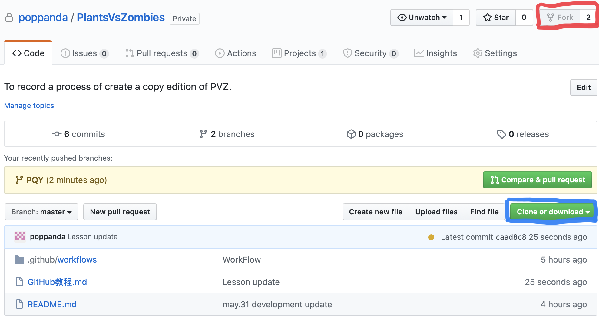
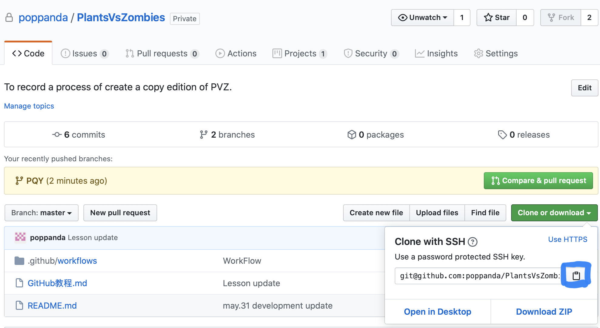
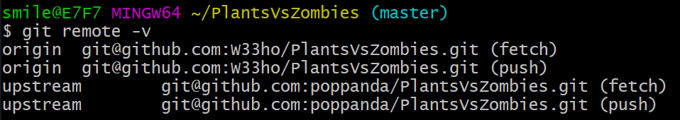

### 身份

你们已经被我添加为了Collaborators，你们拥有了对这个项目仓库的读写权限和向该仓库远程提交的权限，但是这个项目仓库不会出现在你们的仓库里，因此需要Fork & Pull request

### Fork & Pull request

#### Fork

在项目的右上角有一个Fork（红色标注部分），点击后就会将它镜像到你的仓库

#### 将项目创建到本地

1、打开**你的github仓库**，找到Fork的项目，然后点击Clone or download（上图那个绿色的键）得到下图的链接，然后点击蓝色框出来的按钮复制这个地址

2、连接自己的仓库

在本地新建一个文件夹（以后的工作目录），右键，点击Git Bash Here

> 输入 git remote add origin +你刚刚复制的地址(右键，paste)
>
> 例如： git remote add origin git@github.com:poppanda/PlantsVsZombies.git

此时相当于把你的仓库(origin)连接到了本地

> 输入 git remote -v

得到类似于下图的结果

=======

3、连接项目的仓库

打开项目原地址（[即为我的仓库的地址](https://github.com/poppanda/PlantsVsZombies)），重复上述操作(复制项目地址)

> 输入git remote add upstream  git@github.com:poppanda/PlantsVsZombies.git

就连接到了原仓库

> 输入git remote -v

可以看到upstream已经连接上了

4、同步到本地

> 输入 git pull upstream master

完成同步

### 问题：fatal: HttpRequestException encountered.

问题原因：Github更新了证书，需要在本地更新

解决方法：[证书下载地址

下载最新版本，安装即可

