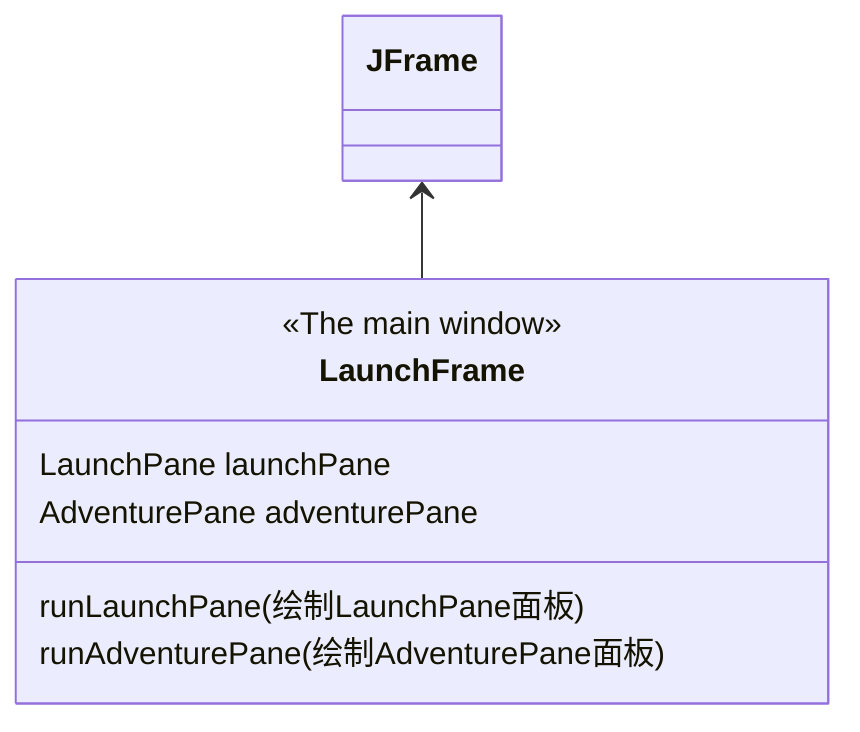
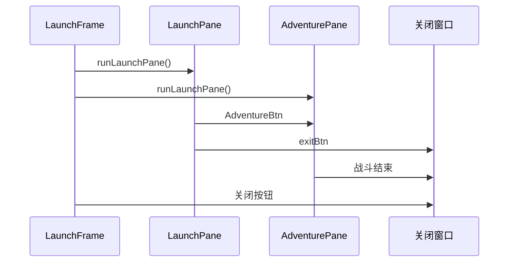
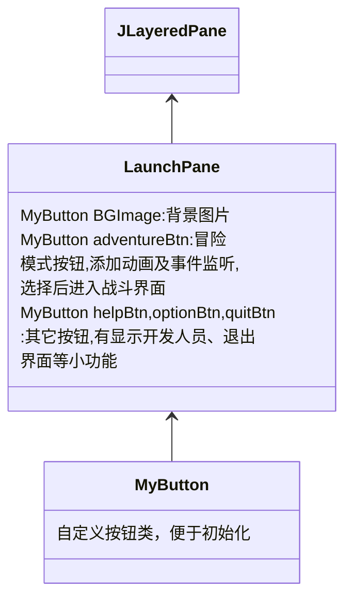
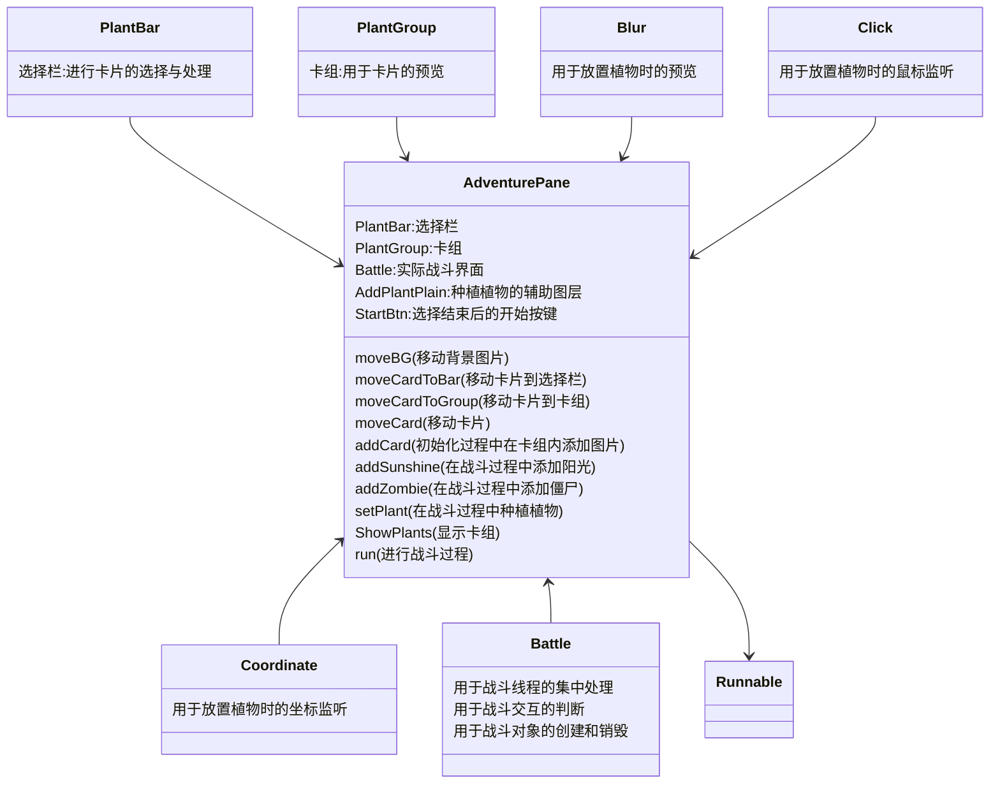

### LaunchFrame

对整体框架进行绘制

其中 LaunchPane 和 AdventurePane 均为JLayeredPane的子类，用于绘制具体的界面

```mermaid
classDiagram
class LaunchFrame{
	<<The main window>>
	LaunchPane launchPane
	AdventurePane adventurePane
	runLaunchPane(绘制LaunchPane面板)
	runAdventurePane(绘制AdventurePane面板)
}
JFrame <--LaunchFrame
```

#### 关系图

LaunchFrame 中的几个要素之间的关联满足以下关系

```mermaid
sequenceDiagram
LaunchFrame ->> LaunchPane:runLaunchPane()
LaunchFrame ->> AdventurePane:runLaunchPane()
LaunchPane ->> AdventurePane:AdventureBtn
LaunchPane ->> 关闭窗口:exitBtn
AdventurePane ->> 关闭窗口:战斗结束
LaunchFrame ->> 关闭窗口:关闭按钮
```

### LaunchPane

负责绘制初始界面

```mermaid
classDiagram
class LaunchPane{
	MyButton BGImage:背景图片
	MyButton adventureBtn:冒险
	模式按钮,添加动画及事件监听,
	选择后进入战斗界面
	MyButton helpBtn,optionBtn,quitBtn
	:其它按钮,有显示开发人员、退出
	界面等小功能
}
class MyButton{
	自定义按钮类，便于初始化
}
JLayeredPane<--LaunchPane
LaunchPane<--MyButton
```

```mermaid
classDiagram
class AdventurePane{
	PlantBar:选择栏
	PlantGroup:卡组
	Battle:实际战斗界面
	AddPlantPlain:种植植物的辅助图层
	StartBtn:选择结束后的开始按键
	moveBG(移动背景图片)
	moveCardToBar(移动卡片到选择栏)
	moveCardToGroup(移动卡片到卡组)
	moveCard(移动卡片)
	addCard(初始化过程中在卡组内添加图片)
	addSunshine(在战斗过程中添加阳光)
	addZombie(在战斗过程中添加僵尸)
	setPlant(在战斗过程中种植植物)
	ShowPlants(显示卡组)
	run(进行战斗过程)
}
class Blur{
	用于放置植物时的预览
}
class Click{
	用于放置植物时的鼠标监听
}
class Coordinate{
	用于放置植物时的坐标监听
}
class Battle{
	用于战斗线程的集中处理
	用于战斗交互的判断
	用于战斗对象的创建和销毁
}
class PlantBar{
	选择栏:进行卡片的选择与处理
}
class PlantGroup{
	卡组:用于卡片的预览
}
PlantBar -->AdventurePane
PlantGroup -->AdventurePane
Blur -->AdventurePane
Click -->AdventurePane
AdventurePane <--Coordinate
AdventurePane <--Battle
AdventurePane-->Runnable
```

