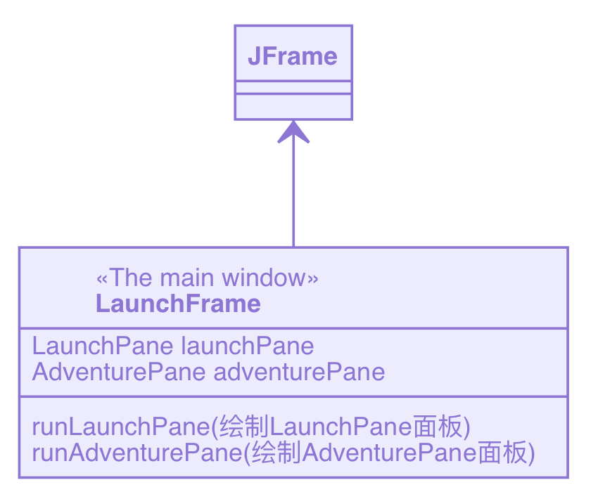
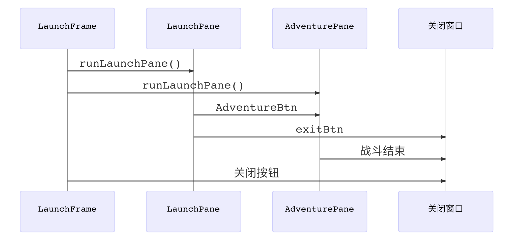
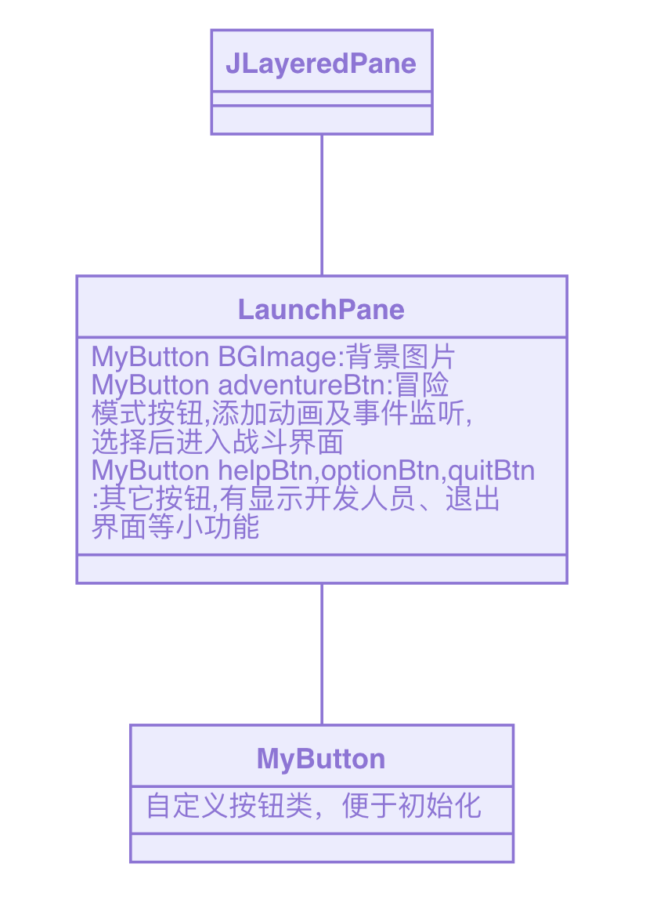
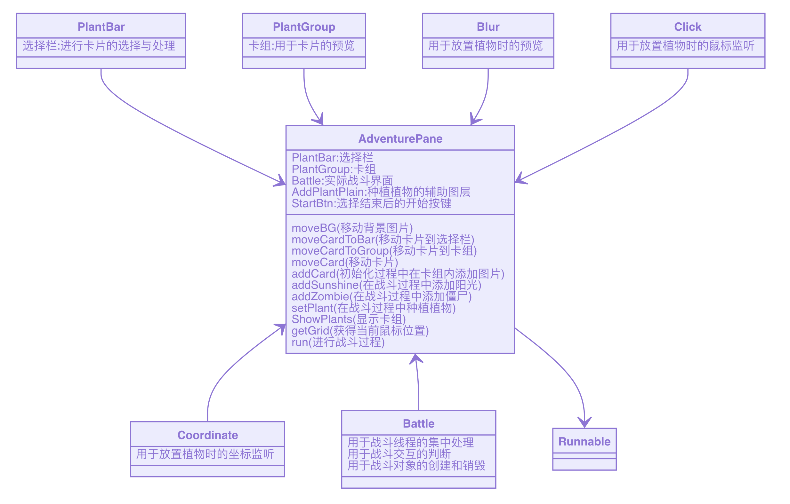
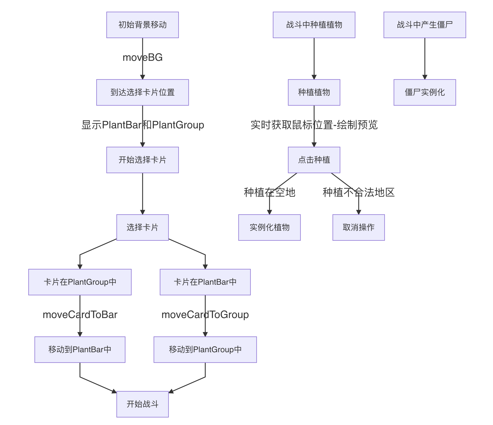
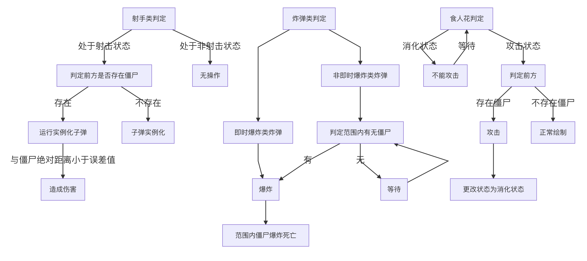

### LaunchFrame

对整体框架进行绘制

其中 LaunchPane 和 AdventurePane 均为JLayeredPane的子类，用于绘制具体的界面

#### 关系图

LaunchFrame 中的几个要素之间的关联满足以下关系

### LaunchPane

LaunchPane负责绘制初始界面

### AdventurePane

AdventurePane负责战斗界面的绘制和处理，包括选择卡片界面、战斗界面的绘制和植物与僵尸之间关系的处理

处理过程如下

植物类相关判定

僵尸类相关判定

