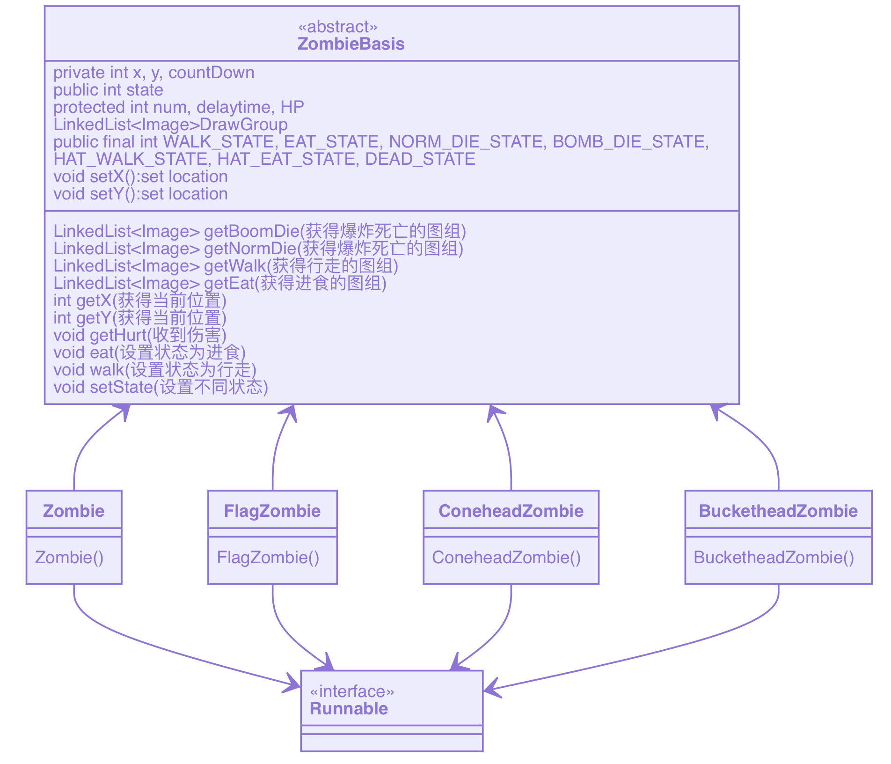
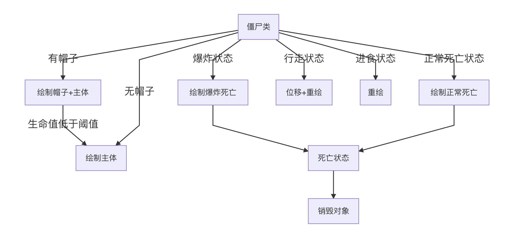

### ZombieBasis类

记录僵尸类相关数据，绘制相关图形

僵尸类的绘制过程

三、动画实现及状态判断

创建僵尸的同时通过getXX().add()方法将图片储存进在父类中定义好的缓存区，在run方法里按照编号不断循环绘制图片，实现动画效果

state标记僵尸当前状态，根据不同时间段下僵尸状态的改变修改DrawGroup以此控制改变动画效果

另：Zombiefatory通过读取txt文件获取关卡的僵尸类信息并完成对其实例化的申请