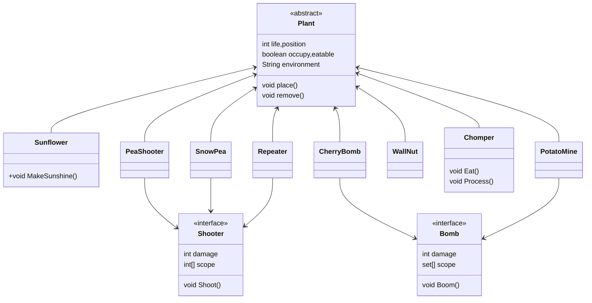

```mermaid
classDiagram
class Plant{
	<<abstract>>
	int life,position
	boolean occupy,eatable
	String environment
	void place()
	void remove()
}

class Shooter{
	<<interface>>
	int damage
	int[] scope
	void Shoot()
}


class Bomb{
	<<interface>>
	int damage
	set[] scope
	void Boom()
}

class Sunflower{
	+void MakeSunshine()
}

class PeaShooter

class Repeater

class SnowPea

class CherryBomb

class WallNut

class Chomper{
	void Eat()
	void Process()
}

class PotatoMine

Plant<--Sunflower
Plant<--PeaShooter
Plant<--SnowPea
Plant<--WallNut
Plant<--Chomper
Plant<--PotatoMine
Plant<--CherryBomb
Plant<--Repeater

PeaShooter-->Shooter
SnowPea-->Shooter
Repeater-->Shooter

CherryBomb-->Bomb
PotatoMine-->Bomb
```

