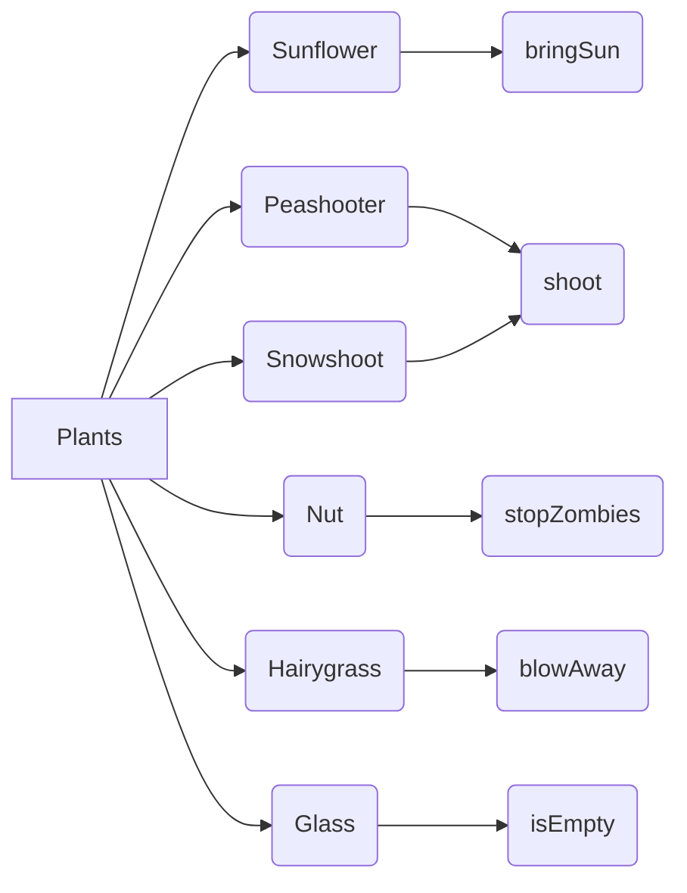
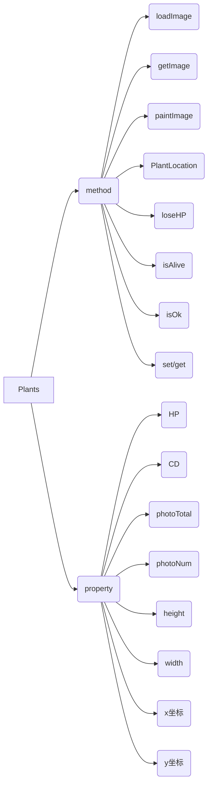
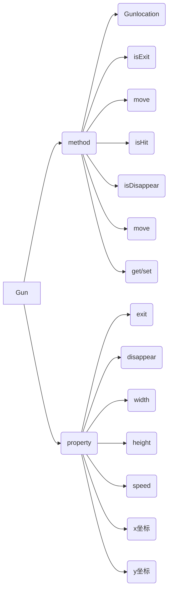

## Plants总述

1.植物及其特有方法

```mermaid
graph LR
A[Plants] --> b(Sunflower) --> h(bringSun)
A --> c(Peashooter) --> i(shoot)
A --> d(Snowshoot) --> i
A --> e(Nut) --> j(stopZombies)
A --> f(Hairygrass) --> k(blowAway)
A --> g(Glass) --> l(isEmpty)
```

2.植物通用属性及方法

```mermaid
graph LR
A[Plants] --> b(method)
A --> c(property)
b --> d(loadImage)
b --> e(getImage)
b --> f(paintImage)
b --> g(PlantLocation)
b --> h(loseHP)
b --> i(isAlive)
b --> j(isOk)
b --> k(set/get)
c --> l(HP)
c --> m(CD)
c --> n(photoTotal)
c --> o(photoNum)
c --> p(height)
c --> q(width)
c --> r(x坐标)
c --> s(y坐标)
```

3.子弹类

```mermaid
graph LR
A[Gun] --> b(method)
A --> c(property)
b --> d(Gunlocation)
b --> e(isExit)
b --> f(move)
b --> g(isHit)
b --> h(isDisappear)
b --> i(move)
b --> j(get/set)
c --> k(exit)
c --> l(disappear)
c --> m(width)
c --> n(height)
c --> o(speed)
c --> p(x坐标)
c --> q(y坐标)

```

