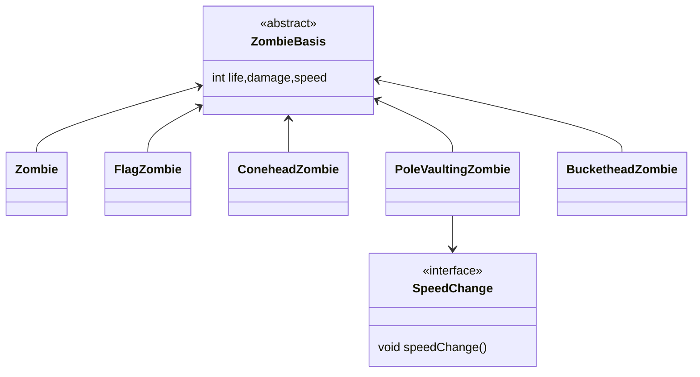

```mermaid
classDiagram
class ZombieBasis{
	<<abstract>>
	int life,damage,speed
}

class SpeedChange{
	<<interface>>
	void speedChange()
}

class	Zombie
class FlagZombie
class ConeheadZombie
class PoleVaultingZombie
class BucketheadZombie

ZombieBasis<--Zombie
ZombieBasis<--FlagZombie
ZombieBasis<--ConeheadZombie
ZombieBasis<--PoleVaultingZombie
ZombieBasis<--BucketheadZombie

PoleVaultingZombie-->SpeedChange
```

