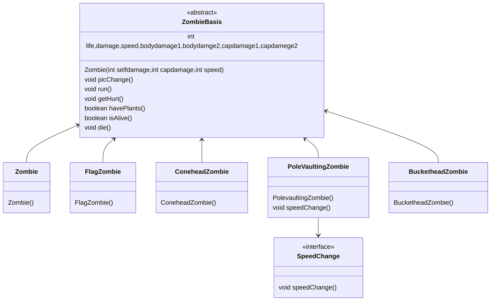

```mermaid
classDiagram
class ZombieBasis{
	<<abstract>>
	int life,damage,speed,bodydamage1,bodydamge2,capdamage1,capdamege2
	Zombie(int selfdamage,int capdamage,int speed)
	void picChange()
	void run()
	void getHurt()
	boolean havePlants()
	boolean isAlive()
	void die()
}

class SpeedChange{
	<<interface>>
	void speedChange()
}

class	Zombie
class FlagZombie
class ConeheadZombie
class PoleVaultingZombie
class BucketheadZombie

class Zombie{
    Zombie()
}

class FlagZombie{
    FlagZombie()
}

class ConeheadZombie{
    ConeheadZombie()
}

class PoleVaultingZombie{
    PolevaultingZombie()
    void speedChange()
}

class BucketheadZombie{
   BucketheadZombie()
}


ZombieBasis<--Zombie
ZombieBasis<--FlagZombie
ZombieBasis<--ConeheadZombie
ZombieBasis<--PoleVaultingZombie
ZombieBasis<--BucketheadZombie

PoleVaultingZombie-->SpeedChange
```

