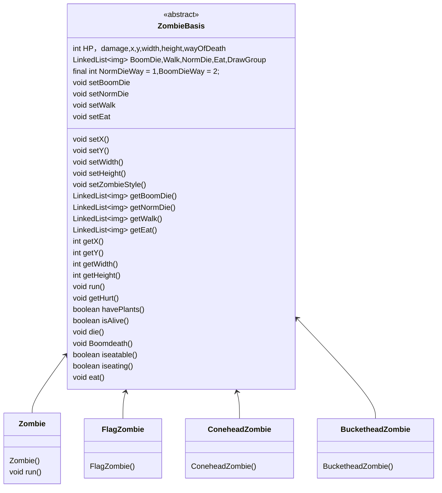

```mermaid
classDiagram
class ZombieBasis{
	<<abstract>>
	int HP，damage,x,y,width,height,wayOfDeath
	LinkedList<Image> BoomDie,Walk,NormDie,Eat,DrawGroup
	final int NormDieWay = 1,BoomDieWay = 2;
	
	void setX()
	void setY()
	void setWidth()
	void setHeight()
	void setZombieStyle()
    void setBoomDie
	void setNormDie
	void setWalk
	void setEat
	LinkedList<Image> getBoomDie()
	LinkedList<Image> getNormDie()
	LinkedList<Image> getWalk()
	LinkedList<Image> getEat()
	int getX()
	int getY()
	int getWidth()
	int getHeight()
	void run()
	void getHurt()
	boolean havePlants()
	boolean isAlive()
	void die()
	void Boomdeath()
	boolean iseatable()
	boolean iseating()
	void eat()
}

class	Zombie
class FlagZombie
class ConeheadZombie
class BucketheadZombie

class Zombie{
    Zombie()
    void run()
}

class FlagZombie{
    FlagZombie()
}

class ConeheadZombie{
    ConeheadZombie()
}


class BucketheadZombie{
   BucketheadZombie()
}


ZombieBasis<--Zombie
ZombieBasis<--FlagZombie
ZombieBasis<--ConeheadZombie
ZombieBasis<--BucketheadZombie
```

