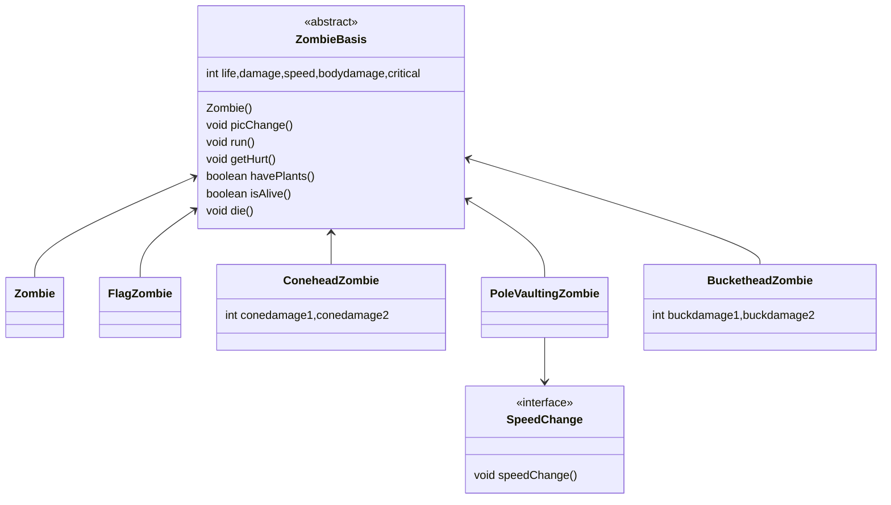

```mermaid
classDiagram
class ZombieBasis{
	<<abstract>>
	int life,damage,speed,bodydamage,critical
	Zombie()
	void picChange()
	void run()
	void getHurt()
	boolean havePlants()
	boolean isAlive()
	void die()
}

class SpeedChange{
	<<interface>>
	void speedChange()
}

class	Zombie
class FlagZombie
class ConeheadZombie
class PoleVaultingZombie
class BucketheadZombie

class ConeheadZombie{
    int conedamage1,conedamage2
}

class BucketheadZombie{
    int buckdamage1,buckdamage2
}


ZombieBasis<--Zombie
ZombieBasis<--FlagZombie
ZombieBasis<--ConeheadZombie
ZombieBasis<--PoleVaultingZombie
ZombieBasis<--BucketheadZombie

PoleVaultingZombie-->SpeedChange
```

