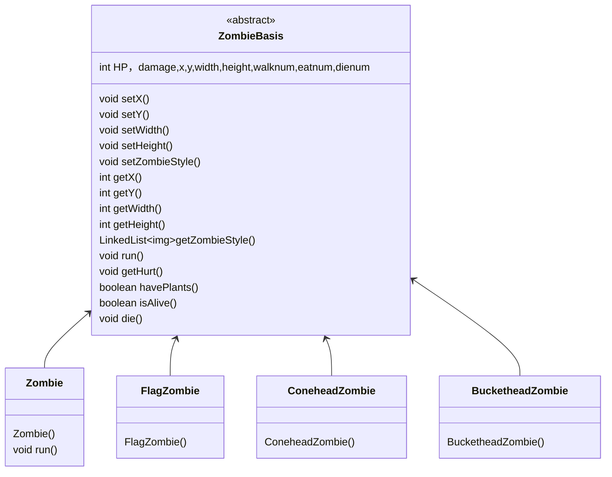

```mermaid
classDiagram
class ZombieBasis{
	<<abstract>>
	int HP，damage,x,y,width,height,walknum,eatnum,dienum
	void setX()
	void setY()
	void setWidth()
	void setHeight()
	void setZombieStyle()
	int getX()
	int getY()
	int getWidth()
	int getHeight()
	LinkedList<Image>getZombieStyle()
	void run()
	void getHurt()
	boolean havePlants()
	boolean isAlive()
	void die()
}

class	Zombie
class FlagZombie
class ConeheadZombie
class BucketheadZombie

class Zombie{
    Zombie()
    void run()
}

class FlagZombie{
    FlagZombie()
}

class ConeheadZombie{
    ConeheadZombie()
}


class BucketheadZombie{
   BucketheadZombie()
}


ZombieBasis<--Zombie
ZombieBasis<--FlagZombie
ZombieBasis<--ConeheadZombie
ZombieBasis<--BucketheadZombie
```

