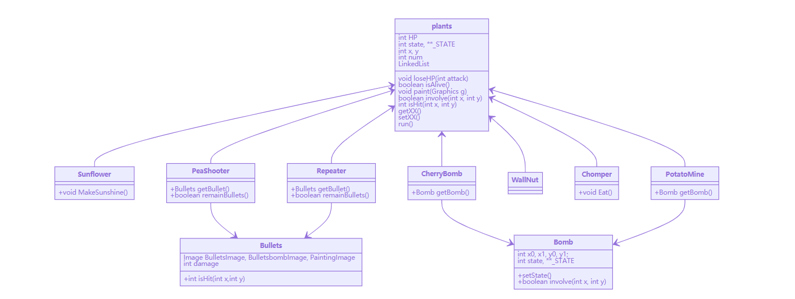
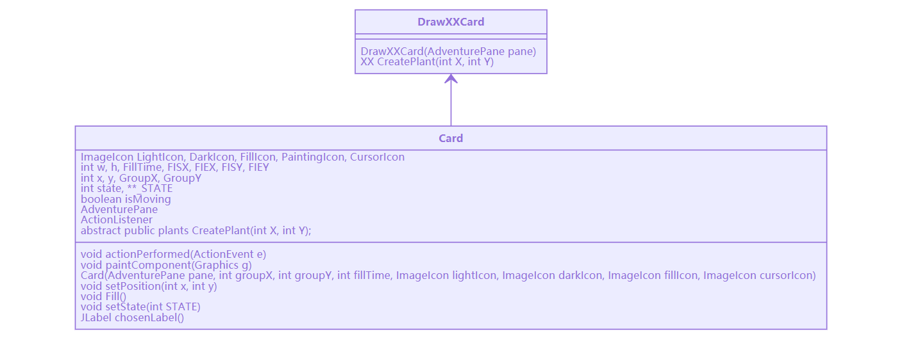
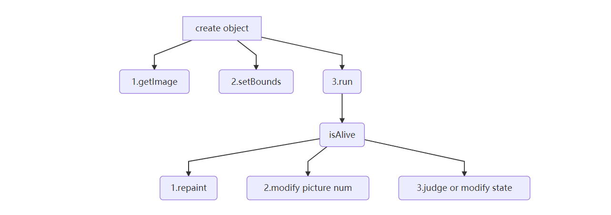

## plants类总述

### 一、植物类基本属性和方法

所有细分的植物都继承自父类plants，父类中定义基本属性和方法，并使用LinkedList存储绘制动画需要的图片

植物重写父类run()方法，实现动画，不同植物根据动作增加独有的方法

### 二、卡片绘制

父类Card定义了放置卡片和选择卡片的功能，绘制不同的植物选项卡只要继承父类将所需参数添加进去即可

### 三、动画实现及状态判断

创建植物的同时通过getXX().add()方法将图片储存进在父类中定义好的缓存区，在run方法里按照编号不断循环绘制图片，实现动画效果

state标记植物当前状态，根据不同时间段下植物状态的改变修改DrawGroup以此控制改变动画效果

对于射出子弹实现子弹的移动效果，基本原理与上图相同，只需要在repaint()里增加setBounds()方法每次使x的值递增即可

